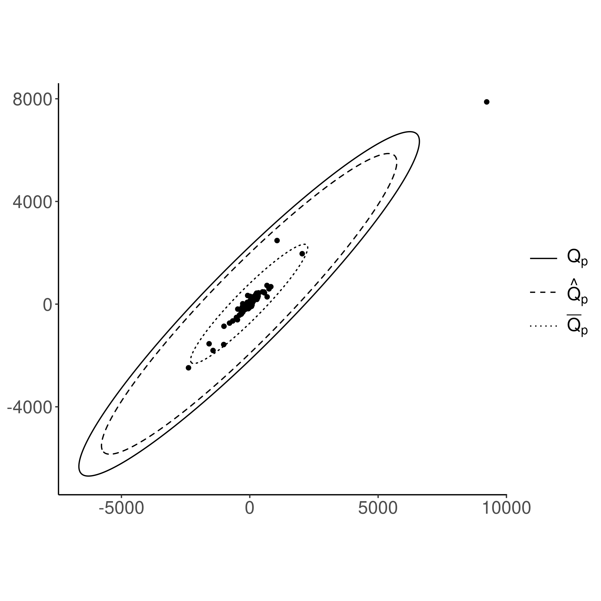

# elliptical-sim

Simulated data examples for an article about multivariate extreme quantile
region estimation. Simulations produce figures of the following form.



In above figure $Q_p$ denotes the true $(1-p)$-quantile region, $\bar Q_p$
denotes estimate based on sample quantile and $\hat Q_p$ denotes estimate based
on the extreme quantile region estimator proposed in the article.

## Running the simulation

1. Clone or unzip the repository.

```
git clone https://github.com/perej1/elliptical-sim.git
```

2. Install required packages by running the following R command in the project's
   root folder.

```
renv::restore()
```
3. Run simulations.

```
bash plot-batch.sh
```

As an result a folder `figures` will be generated (if it does not already
exist). The folder includes generated figures.
