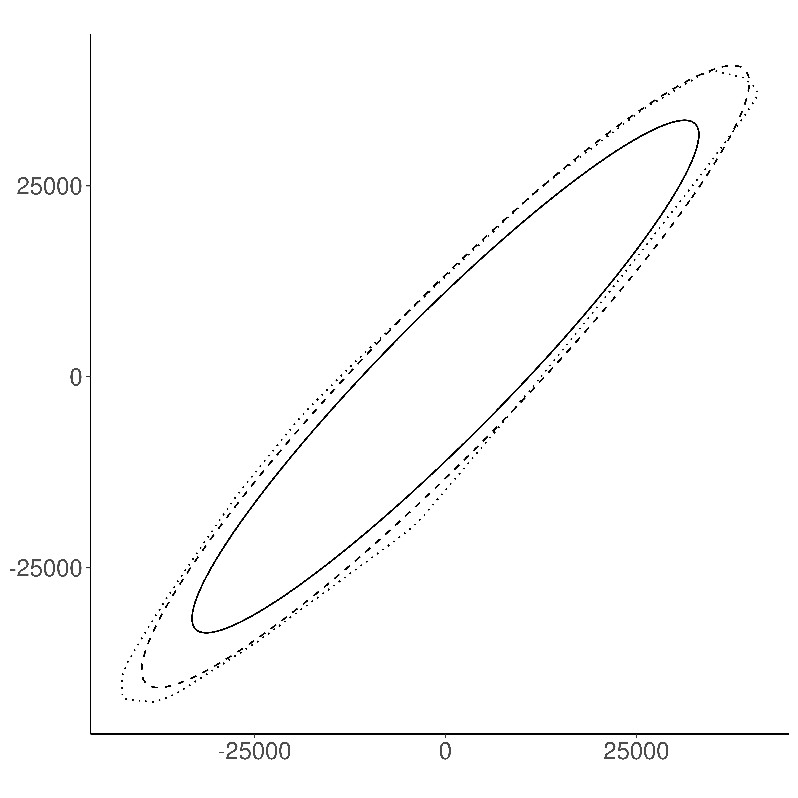
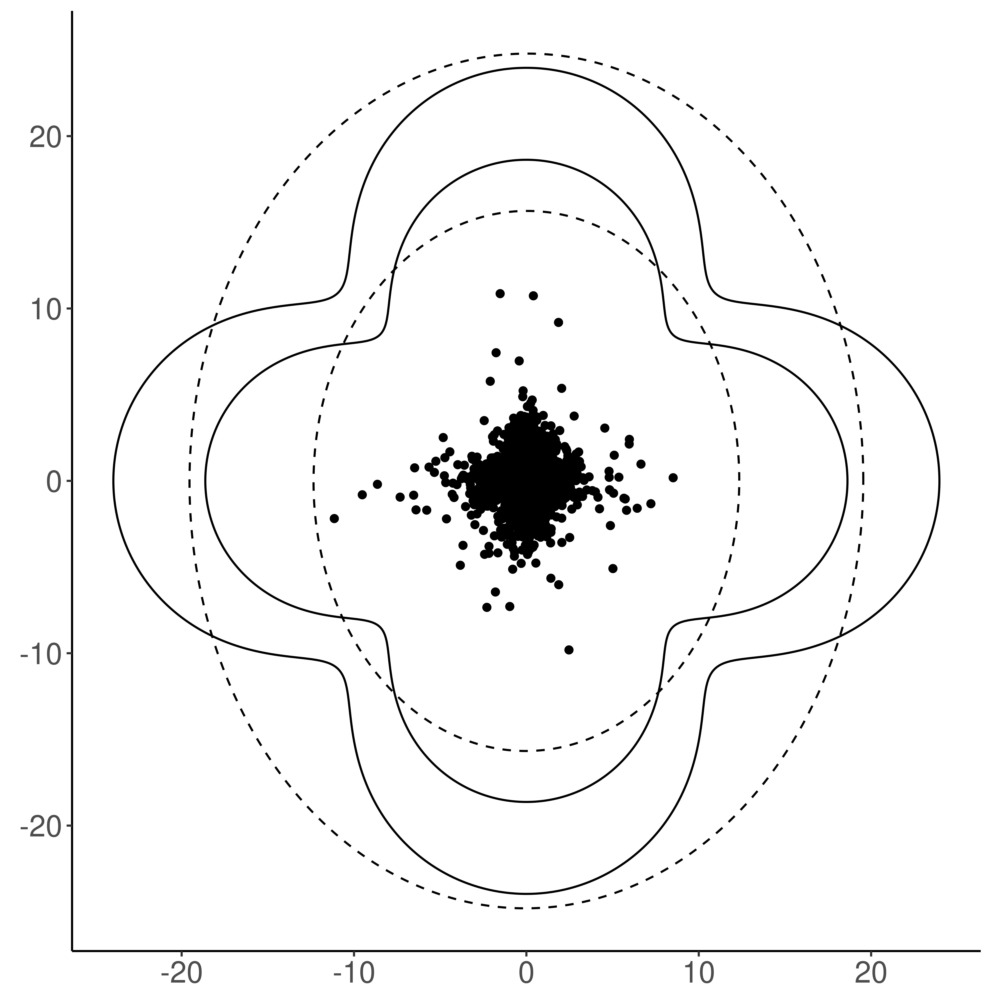

# elliptical-sim

Simulation study for an article about multivariate extreme quantile
region estimation. Two things are done in simulations:

1. Performance of an elliptical extreme quantile region estimator $\hat Q_{p_n}$
is compared to a competing extreme quantile region estimator $\bar Q_{p_n}$
based on halfspace depth. Relative errors $\mathbb{P}(X\in\hat Q_{p_n}\triangle
Q_{p_n})/p_n$ and $\mathbb{P}(X\in\bar Q_{p_n}\triangle Q_{p_n})/p_n$ are
computed for each simulation scenario. Relative errors for each scenario are
saved in directory `sim-data/errors`. Additionally, samples from which estimates
are calculated, true quantile regions $Q_{p_n}$, estimates $\hat Q_{p_n}$ and
estimates $\bar Q_{p_n}$ are saved in directories in `sim-data/` for
reproducibility. On the other hand, directory `summmary-data/` includes some
statistics such as minimum, median and maximum error for each scenario. Also,
figures corresponding to minimum, median and maximum relative errors are
included. Below is the figure corresponding to the median relative error for a
certain scenario. In the figure solid line represents the true quantile region
$Q_{p_n}$, dashed line represents estimate $\hat Q_{p_n}$ and dotted line
represents the competitor $\bar Q_{p_n}$.


2. An example with nonelliptical quantile regions is constructed. Here we use
$\hat Q_{p_n}$ for estimation, and thus, estimated quantile regions have an
elliptical shape. Figures similar to the following are produced.
 On the above figure black dots
represent observations, dashed lines represent estimates $\hat Q_{p_n}$ and
solid lines represent true quantile regions $Q_{p_n}$.

## Running the simulation

1. Clone or unzip the repository.

```
git clone https://github.com/perej1/elliptical-sim.git
```

2. Install required packages by running the following R command in the project's
   root folder.

```
renv::restore()
```
3. Run the script `simulate-batch.R` with desired parameters. For example, below we run simulations as a whole.

```
Rscript simulate-batch.R --simulate TRUE --plot TRUE --clover TRUE
```

## References
